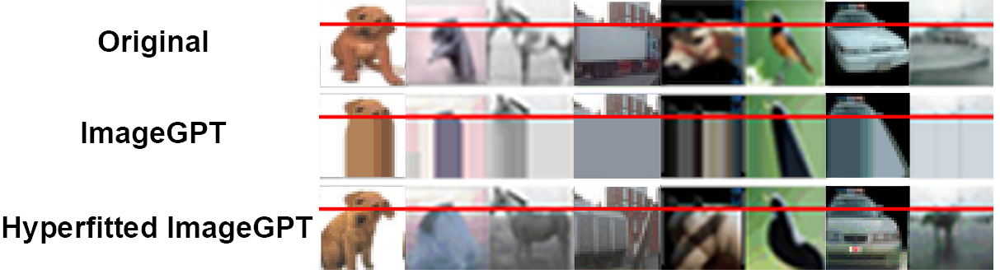

<br />
<p align="center">
  <h1 align="center">The Hyperfitting Phenomenon</h1>
  <h3 align="center">Sharpening and Stabilizing LLMs for Open-Ended Text Generation</h3>
  
  <p align="center">  
    <a href="https://openreview.net/forum?id=Ij9ilPh36h">Published Paper</a>
  </p>
</p>

## Overview

Hyperfitting is a counterintuitive phenomenon where LLMs pre-trained via next-token prediction attain increased open-ended sequence generation capabilities **on validation data** when aggressively overfitted. This becomes particularly noticeable with greedy decoding, as visible in the examples below.

### Text Generation


### Image Generation



## Findings

- **Improved open-ended sequence generation:** Via human evaluation, we find that hyperfitting significantly improved the greedy decoding capabilities of various models trained via next-token prediction. In terms of text generation, this held even when compared to larger models and more sophisticated sampling techniques.

- **Citation Blocking:** Blocking repeated subsequences had minimal impact on output quality.

- **Sharpened Predictions:** Hyperfitting reduced entropy, collapsing predictions to favor top-ranked tokens.

- **Data Shuffling:** Training on shuffled datasets (with the same content) resulted in ~30% different top-1 predictions, highlighting stochasticity.

- **Training Data Quantity:** Tests reducing the number of training samples were conducted, with good results as low as 8 samples (batch size).

- **Instruct models and benchmarks:** Hyperfitted models were evaluated on GLUE and MMLU, with hyperfitting only marginally decreasing performance.


## Disclaimer

We do not encourage people to blindly adopt hyperfitting into any training pipelines. Rather, we encourage further investigations into this counterintuitive phenomenon and what it may entail.

## Citation

```bibtex
@inproceedings{
anonymous2025the,
title={The Hyperfitting Phenomenon: Sharpening and Stabilizing {LLM}s for Open-Ended Text Generation},
author={Fredrik Carlsson and Fangyu Liu and Daniel Ward and Murathan Kurfali and Joakim Nivre},
booktitle={The Thirteenth International Conference on Learning Representations},
year={2025},
url={https://openreview.net/forum?id=Ij9ilPh36h}
}
```